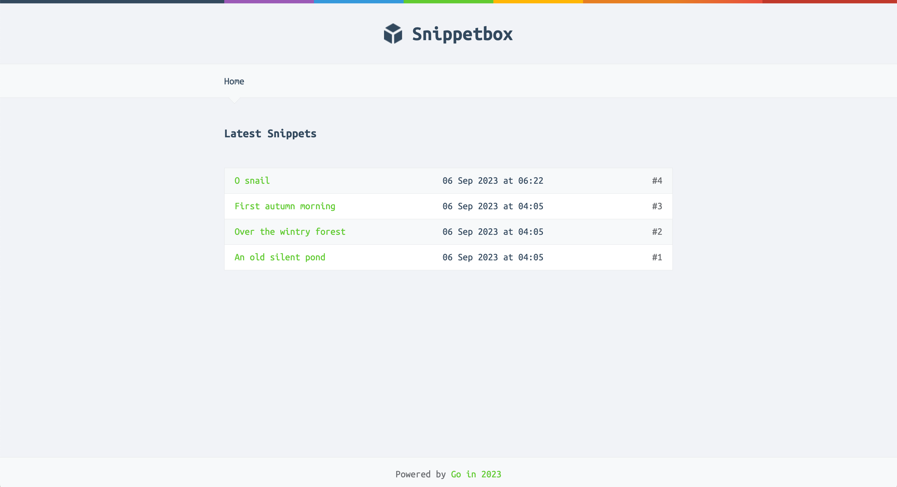

# Snippet Box

A web application wriiten in Go that allows users to add/view snippets.

## Features

- [x] HTML Templating
- [x] Custom Info and Error Logging
- [x] MySQL Integration
- [x] Template Caching
- [x] Panic Recovery Middleware
- [ ] Add Snippets
- [ ] Session Manager
- [ ] HTTPS
- [ ] User Authentication
